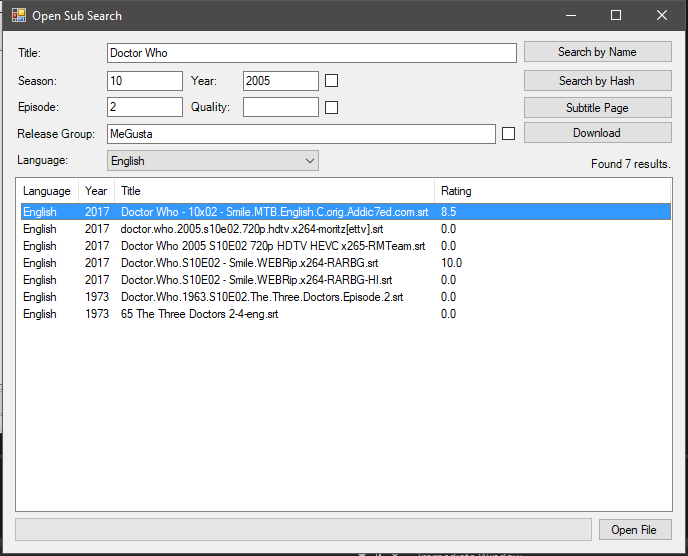
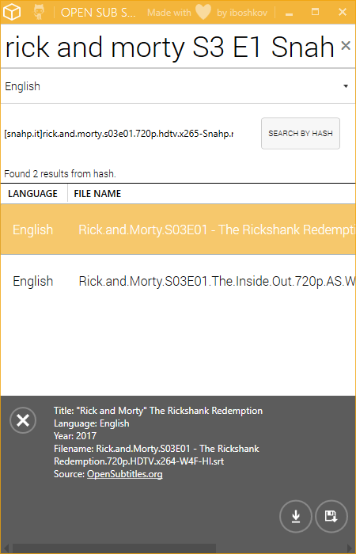

# Open Sub Search

Open Sub Search is a little side project I did in a few days as part of a project related to a course at my university and I though I might as well something I would use on a somewhat regular basis.

### What it does:
  - Parses metadata from a given filename, extracting relevant information such as season, episode release group and so on.
  - Searches through a subtitle provider based on given parameters or a file hash 
  - Provides quick downloading of a chosen subtitle
  - Currently only supports OpenSubtitles.com but I hope to add more services in the future.

### Installation
Just grab a binary release from the [Releases page](https://github.com/iboshkov/open-sub-search/releases)

### How to use:
- Drag and drop a file into the application window, or use the "Open File" button to select a file to use as reference.
- Press either **"Search by Name"** or **"Search by Hash"**.
- Select a subtitle and press **"Download Subtitle"**

### Screenshots

## WPF Version
This is a re-implementation of the frontend for the OpenSubSearchLib and uses WPF instead of the old Windows Forms UI library.
It looks a lot more modern and provides an overall better user experience.

This is the UI that will undergo continued development. The Windows Forms implementation is a one-off proof of concept.

### Screenshots
**You can find a video demo on [Streamable](https://streamable.com/92ikt)** 

### License
MIT (Check LICENSE for more info)